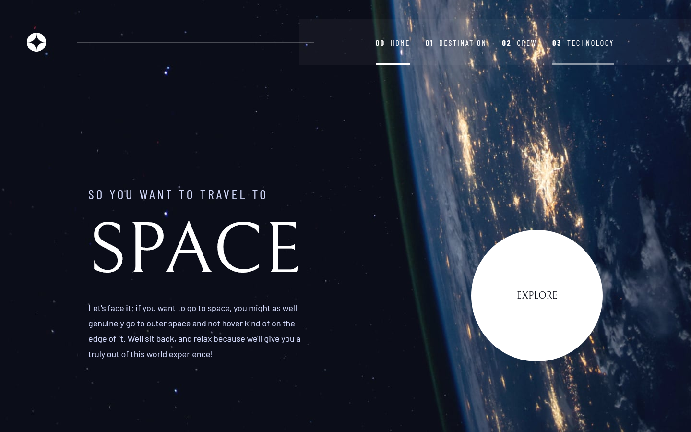

# Frontend Mentor - Space tourism website solution

This is a solution to the [Space tourism website challenge on Frontend Mentor](https://www.frontendmentor.io/challenges/space-tourism-multipage-website-gRWj1URZ3). Frontend Mentor challenges help you improve your coding skills by building realistic projects.

## Table of contents

- [Overview](#overview)
  - [The challenge](#the-challenge)
  - [Screenshot](#screenshot)
  - [Links](#links)
- [My process](#my-process)
  - [Built with](#built-with)
  - [What I learned](#what-i-learned)
  - [Continued development](#continued-development)
  - [Useful resources](#useful-resources)
- [Author](#author)
- [Acknowledgments](#acknowledgments)

**Note: Delete this note and update the table of contents based on what sections you keep.**

## Overview

### The challenge

Users should be able to:

- View the optimal layout for each of the website's pages depending on their device's screen size
- See hover states for all interactive elements on the page
- View each page and be able to toggle between the tabs to see new information

### Screenshot



### Links

- Solution URL: https://github.com/XlichOpX/space-tourism-website
- Live Site URL: https://space-tourism-website-xlichopx.vercel.app/

## My process

### Built with

- Semantic HTML5 markup
- CSS custom properties
- Flexbox
- CSS Grid
- Mobile-first workflow
- [Astro](https://astro.build/) - All-in-one web framework for building fast, content-focused websites.

### What I learned

This was my first time doing a challenge like this and using pure CSS to style a complete website. Although I had learned CSS before, I always used component libraries or frameworks like Chakra UI or TailwindCSS. Therefore, I faced some challenges with CSS structure and organization. For example, I learned how to set up a basic frame from Kevin Powell’s version of this challenge. I also adopted the BEM methodology for writing CSS in a consistent way.

Another challenge was adjusting the site to different screen sizes while matching the figma mockup as closely as possible. I had to rediscover CSS Grid and Flexbox layouts for this purpose. Working with a figma file was a nice experience, but I noticed some details that were not clear in the design system, such as font size differences and letter spacing across screen sizes.

### Useful resources

- [Get BEM](https://getbem.com/) - This helped me adopt the BEM methodology.
- [Kevin Powell's take on this challenge](https://scrimba.com/learn/spacetravel) - I learned a lot from this course, especially the way he structures his CSS foundation.

## Author

- Website - [Yhan Montaño](https://yhanmontanodev.vercel.app/)
- Frontend Mentor - [@XlichOpX](https://www.frontendmentor.io/profile/XlichOpX)

## 🚀 Project Structure

Inside of your Astro project, you'll see the following folders and files:

```
/
├── public/
│   └── favicon.svg
├── src/
│   ├── components/
│   │   └── Card.astro
│   ├── layouts/
│   │   └── Layout.astro
│   └── pages/
│       └── index.astro
└── package.json
```

Astro looks for `.astro` or `.md` files in the `src/pages/` directory. Each page is exposed as a route based on its file name.

There's nothing special about `src/components/`, but that's where we like to put any Astro/React/Vue/Svelte/Preact components.

Any static assets, like images, can be placed in the `public/` directory.

## 🧞 Commands

All commands are run from the root of the project, from a terminal:

| Command                | Action                                           |
| :--------------------- | :----------------------------------------------- |
| `npm install`          | Installs dependencies                            |
| `npm run dev`          | Starts local dev server at `localhost:3000`      |
| `npm run build`        | Build your production site to `./dist/`          |
| `npm run preview`      | Preview your build locally, before deploying     |
| `npm run astro ...`    | Run CLI commands like `astro add`, `astro check` |
| `npm run astro --help` | Get help using the Astro CLI                     |

## 👀 Want to learn more?

Feel free to check [our documentation](https://docs.astro.build) or jump into our [Discord server](https://astro.build/chat).
